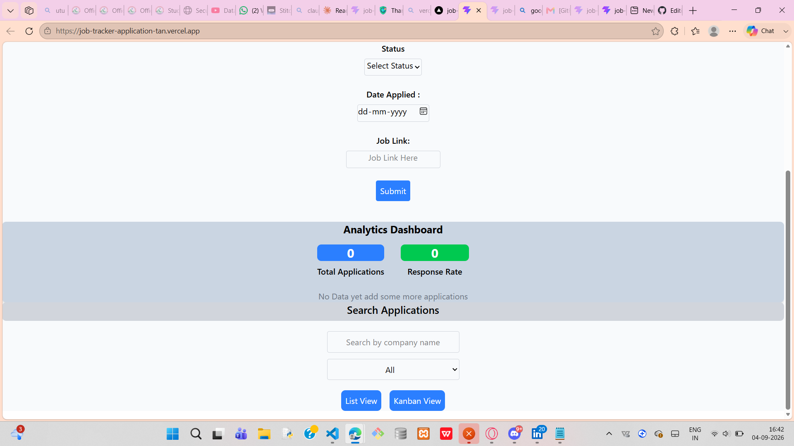
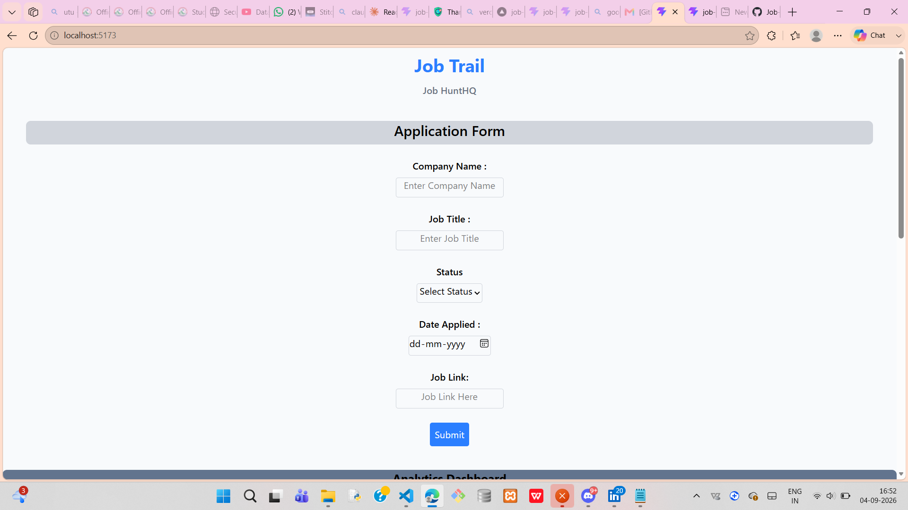
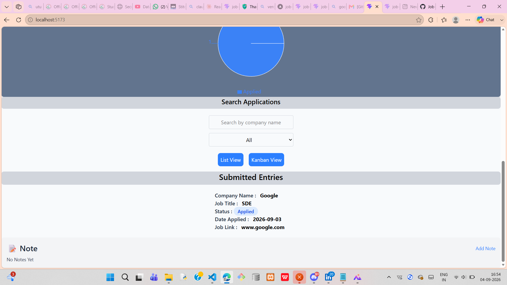
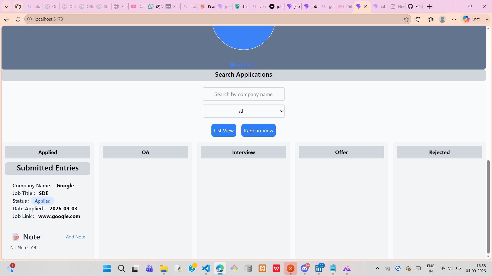
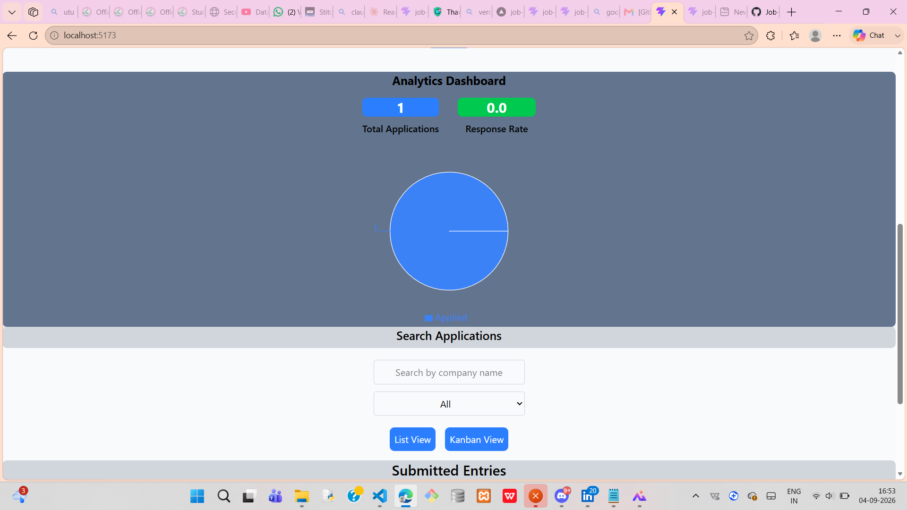

# 🎯 Job Trail — Job Application Tracker

A full-featured job application tracker built with React — track your job search pipeline with a Kanban board, real-time search/filtering, inline notes, and an analytics dashboard.

**🔗 Live Demo:** [https://job-tracker-application-tan.vercel.app/]
** Screenshots ** 


## ✨ Features

- **Add & Track Applications** — Log company name, job title, status, date applied, and job link
- **Dual View Modes**
  - 📋 **List View** — See all applications in a clean, filterable list
  - 🗂️ **Kanban Board** — Drag and drop cards between status columns (Applied → OA → Interview → Offer → Rejected)
- **Real-Time Search & Filter** — Instantly search by company name or filter by application status
- **Inline Notes** — Add and edit notes directly on each application card (e.g. "Recruiter called, next round Friday")
- **Analytics Dashboard** — Visual breakdown of applications by status via pie chart, plus total application count and response rate
- **Persistent Storage** — Your data is saved in the browser via `localStorage`, so it survives page refreshes

---

## 🛠️ Tech Stack

| Category | Technology |
|---|---|
| Frontend | React (Vite) |
| Styling | Tailwind CSS |
| Drag & Drop | [@dnd-kit](https://dndkit.com/) |
| Charts | [Recharts](https://recharts.org/) |
| Persistence | Browser `localStorage` |
| Deployment | Vercel |

---

## 📸 Screenshots






---

## 🚀 Getting Started (Run Locally)

1. Clone the repository
   ```bash
   git clone https://github.com/YOUR_USERNAME/job-trail.git
   cd job-trail
   ```

2. Install dependencies
   ```bash
   npm install
   ```

3. Start the development server
   ```bash
   npm run dev
   ```

4. Open [http://localhost:5173](http://localhost:5173) in your browser

---

## 🧠 What I Learned

Building this project helped me get hands-on with:
- Managing complex state with React hooks (`useState`, `useEffect`)
- Immutable state updates for arrays and objects
- Lifting state up and prop drilling across a multi-component app
- Integrating third-party libraries (`@dnd-kit` for drag-and-drop, `recharts` for data visualization)
- Persisting data client-side with `localStorage`
- Building controlled forms and real-time search/filter logic

---

## 📌 Future Improvements

- User authentication (per-user data with Firebase/Auth)
- Backend + database (Node.js + MongoDB) instead of localStorage
- Follow-up date reminders and notifications
- Export applications to CSV/PDF
- File attachments (resume/cover letter per application)

---

## 📄 License

This project is open source and available under the [MIT License](LICENSE).
